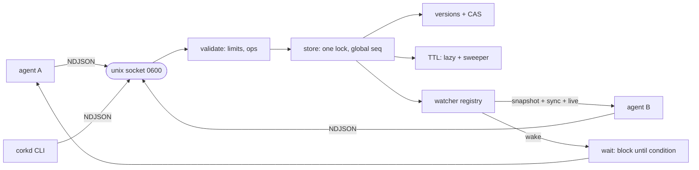

# corkd

[English](README.md) | [中文](README.zh.md) | [日本語](README.ja.md)

[](LICENSE) [](go.mod) [](CHANGELOG.md)  [](CONTRIBUTING.md)

**corkd：同一マシン上のマルチエージェントのためのオープンソース共有黒板 —— unix socket 上の監視可能なキーバリューストア（CAS・TTL 付き）。エージェント同士がスクラッチファイルを奪い合う日々を終わらせる。Redis ではなく、外部サーバーも不要。**


```bash
git clone https://github.com/JaydenCJ/corkd && cd corkd
go build -o corkd ./cmd/corkd    # single static binary, stdlib only
```

> プレリリース：v0.1.0 はまだどのレジストリにも公開されていません。上記のとおりソースからビルドしてください（Go ≥1.22 であれば可）。

## なぜ corkd？

コーディングエージェントを数体並走させると、すぐに共有メモリが必要になります：誰がデプロイロックを持っているか、どのタスクが完了したか、現在のビルド状態は何か。民間療法である JSON スクラッチファイルには、古典的な並行性バグが全部そろっています：2 体のエージェントが同じファイルを read-modify-write して片方の書き込みが消える；クラッシュしたエージェントが古いロックファイルを永遠に残す；「X が変わるまで待つ」がトークンと CPU を焼くポーリングループに退化する。重量級の解である Redis や etcd は、サーバーのインストールと世話、TCP ポートの開放、全エージェントへのクライアントライブラリの持ち込みを意味します——同じマシンに住むプロセスには馬鹿げたオーバーヘッドです。corkd はその中間の欠落を埋めます：パーミッション 0600 の unix socket 越しにメモリ上の黒板を提供する、静的バイナリ 1 個。すべての書き込みがグローバルに一意なバージョンを得るため CAS は自明で ABA 問題とも無縁；TTL はロックを自己修復するリースに変え；watch は「アトミックなスナップショット＋ライブ」のイベントストリームを届け、`corkd wait` があらゆるポーリングループをブロッキング読み取り 1 回に置き換えます。socket に JSON を 1 行書ける言語はすべて完全なクライアント——SDK もポートも、設定すべきデーモンもありません。

| | corkd | スクラッチファイル + flock | Redis | etcd |
|---|---|---|---|---|
| 開発機でのセットアップ | バイナリ 1 個、設定ゼロ | OS 標準 | サーバーの導入と設定 | クラスタ級サーバーの導入と設定 |
| ネットワーク露出 | unix socket、0600、TCP は一切開かない | なし | 既定で TCP ポート | TCP + TLS 証明書 |
| すべての書き込み/削除で CAS | ✅ バージョン、ABA 耐性 | ❌ read-modify-write 競合 | Lua / WATCH-MULTI の儀式 | ✅ revision |
| アトミックな追いつき再生付き watch | ✅ `--state`：スナップショット + sync + ライブ | ❌ | keyspace イベント、ベストエフォート、再生なし | ✅ |
| キーの変化までブロック | ✅ `corkd wait` 内蔵 | ❌ ポーリング | 代用（BLPOP の転用） | watch 上でクライアント実装 |
| 自動失効するロック（TTL） | ✅ | ❌ クラッシュで古いファイルが残る | ✅ | ✅ リース |
| クライアント要件 | JSON + socket が書ければ何でも、または CLI | shell | クライアントライブラリ | gRPC クライアントライブラリ |
| 実行時依存 | 0（Go 標準ライブラリ） | 0 | サーバーデーモン | サーバーデーモン |

<sub>2026-07-13 時点で確認：corkd の import は Go 標準ライブラリのみ。Redis と etcd は本来の領分——ネットワーク越し・永続化・複数マシンの状態——では傑出しています；corkd は単一マシン・マルチエージェントの一点だけをあえて争います。</sub>

## 機能

- **どこでも CAS、ABA 耐性** —— 各書き込みはグローバルなシーケンス番号を 1 つ消費し、バージョンは黒板全体で一意かつ再利用されない；`--if-version`（0 = 作成専用）と `--if-absent` が更新消失を不可能にし、競合レスポンスは現在のバージョンを運ぶので再試行に追加の往復は不要。
- **正確で観測可能な TTL リース** —— 失効はアクセス時に遅延判定され、タイマーで能動的に掃除され、必ず `expire` イベントを発行；クラッシュしたロック保持者のロックは自動で解放される。
- **取りこぼさない watch** —— `watch --state` は同一ロック下でスナップショットと購読をアトミックに実行：現在状態の `put` イベント、`sync` マーカー、そして欠番のないシーケンス番号のライブイベントが続く。遅い消費者は `lagged` マーカー付きで切断され、黒板を停滞させることは決してない。
- **ポーリングループの代わりにブロッキング待機** —— `corkd wait KEY`、`--equals VALUE`、`--gone` はサーバー側で条件成立かタイムアウトまでクライアントを待機させる；バリアもロック待ち行列もワンライナーになる。
- **`nc` で直接話せるプロトコル** —— unix socket 上の改行区切り JSON（[docs/protocol.md](docs/protocol.md)）；どの言語にも最初からクライアントが備わっている。
- **スクリプトネイティブな CLI** —— 終了コード 0/1/2/3 が「条件不成立」と本物のエラーを分離し、`if corkd set --if-absent …` がそのまま動く；機械向けに全コマンドで `--json`、人間向けに `keys`/`dump`/`stats`。
- **依存ゼロ、露出ゼロ** —— Go 標準ライブラリのみ、TCP リスナーなし、socket は 0600、テレメトリなし、設定不要。

## クイックスタート

```bash
corkd serve &                                   # the board (one per user by default)
corkd set build/status green                    # publish
corkd get build/status                          # read
corkd set --if-absent --ttl 30s lock/deploy agent-a   # take a lease-lock
```

実際にキャプチャした出力：

```text
$ corkd set --if-absent --ttl 30s lock/deploy agent-a
ok key=lock/deploy version=2 ttl_ms=30000
$ corkd set --if-absent --ttl 30s lock/deploy agent-b
corkd: exists: key already exists                # exit code 1 — agent-b lost the race
$ corkd get --json lock/deploy
{"ok":true,"key":"lock/deploy","value":"agent-a","version":2,"ttl_ms":29863}
```

2 つのワーカーがそれぞれ `corkd incr jobs/done` を実行した後、アトミックな追いつき再生付きで黒板全体を監視（実出力）：

```text
$ corkd watch --state --count 4 ''
{"event":"put","key":"build/status","value":"green","version":1,"seq":1}
{"event":"put","key":"jobs/done","value":"2","version":4,"seq":4}
{"event":"put","key":"lock/deploy","value":"agent-a","version":2,"seq":2}
{"event":"sync","seq":4}
```

別のエージェントが公開するまでブロック——ポーリングループなし（実出力）：

```text
$ corkd wait --timeout 10s go        # blocks…
now                                  # …until someone runs: corkd set go now
```

## CLI リファレンス

`corkd <command> [flags] [args]` —— フラグは位置引数より前に書く。終了コード：0 成功、1 条件不成立（キー不在、CAS 競合、wait タイムアウト）、2 使い方の誤り、3 接続/サーバーエラー。

| コマンド | 主なフラグ | 効果 |
|---|---|---|
| `serve` | `--socket`, `--sweep-interval`, `--quiet` | 黒板をフォアグラウンドで実行；SIGTERM で socket を後始末 |
| `set KEY VALUE` | `--ttl`, `--if-version N`, `--if-absent` | 書き込み（VALUE が `-` なら stdin から）；バージョンで CAS、0 = 作成専用 |
| `get KEY` | `--json` | 値を表示（JSON はバージョンと残り TTL 付き） |
| `del KEY` | `--if-version N` | 削除、古いバージョンに基づく誤削除をガード可能 |
| `incr KEY` | `--by N`, `--ttl` | アトミックなカウンタ；負の増分も可；既定で TTL を保持 |
| `wait KEY` | `--equals V`, `--gone`, `--timeout` | 条件成立までブロック；成立時の値を表示 |
| `watch [PREFIX]` | `--state`, `--count N` | NDJSON イベントをストリーム；`--state` = 先にアトミックなスナップショット再生 |
| `keys` / `dump [PREFIX]` | `--json` | ソート済み一覧、値と TTL なし / あり |
| `stats` / `ping` | `--json` | 黒板のカウンタ / 生存確認 + サーバーバージョン |

socket パスは `--socket` フラグ → `$CORKD_SOCKET` → `$XDG_RUNTIME_DIR/corkd.sock` → `$TMPDIR/corkd-<uid>.sock` の順に解決され、同一ユーザーのエージェント全員が設定ゼロで同じ黒板にたどり着きます。

## 協調レシピ

3 つのイディオムでマルチエージェント協調の大半をカバーできます；[examples/](examples/README.md) が最初の 2 つをエンドツーエンドで実行します。

| パターン | レシピ |
|---|---|
| クラッシュ保険付きミューテックス | `set --if-absent --ttl 30s lock/X me` → 作業 → `del lock/X`；敗者は `wait --gone lock/X` |
| バリア / 受け渡し | 生産者：`set task/1 result`；消費者：`wait --timeout 60s task/1` |
| 進捗の集約 | 各ワーカーが `incr tasks/completed`；監督者が `wait --equals N tasks/completed` |

## 検証

このリポジトリは CI を同梱しません；上記のすべての主張はローカル実行で検証されています：

```bash
go test ./...            # 91 deterministic tests, offline, fake-clock TTLs, < 5 s
bash scripts/smoke.sh    # end-to-end CLI check over a real socket, prints SMOKE OK
```

## アーキテクチャ



## ロードマップ

- [x] v0.1.0 —— unix socket 上の CAS/TTL 黒板：アトミックな状態再生付き watch、ブロッキング wait、アトミックカウンタ、NDJSON プロトコル、スクリプトに優しい CLI、91 テスト + smoke スクリプト
- [ ] サーバー再起動を生き延びる任意のスナップショットファイル（`--snapshot board.json`）
- [ ] `corkd lock` シュガー：取得 → コマンド実行 → 解放、TTL ハートビート更新付き
- [ ] プレフィックス以外の watch フィルタ（glob、イベント種別）と `since_seq` 再開
- [ ] 事後デバッグ用のキー別履歴リング（`corkd log KEY`）
- [ ] クライアントパッケージ（Go module の公開、Python）—— プロトコル自体がすでにそれを容易にしている

全リストは [open issues](https://github.com/JaydenCJ/corkd/issues) を参照してください。

## コントリビュート

Issue・ディスカッション・PR を歓迎します —— ローカルの作業手順（フォーマット、vet、テスト、`SMOKE OK`）は [CONTRIBUTING.md](CONTRIBUTING.md) を参照。入門向けタスクは [good first issue](https://github.com/JaydenCJ/corkd/issues?q=is%3Aissue+is%3Aopen+label%3A%22good+first+issue%22) ラベル、設計の議論は [Discussions](https://github.com/JaydenCJ/corkd/discussions) へ。

## ライセンス

[MIT](LICENSE)
