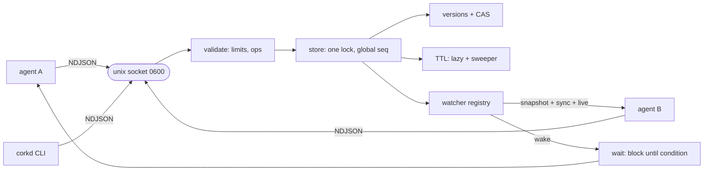

# corkd

[English](README.md) | [中文](README.zh.md) | [日本語](README.ja.md)

[](LICENSE) [](go.mod) [](CHANGELOG.md)  [](CONTRIBUTING.md)

**corkd：an open-source shared blackboard for co-located agents — a watchable key-value store with compare-and-swap and TTL over a unix socket, so your agents stop racing each other through scratch files. Not Redis; no external server.**


```bash
git clone https://github.com/JaydenCJ/corkd && cd corkd
go build -o corkd ./cmd/corkd    # single static binary, stdlib only
```

> Pre-release: v0.1.0 is not tagged on a package registry yet; build from source as above (any Go ≥1.22).

## Why corkd?

Run a few coding agents side by side and they immediately need shared memory: who holds the deploy lock, which tasks are done, what the current build status is. The folk solution — JSON scratch files — has every classic concurrency bug: two agents read-modify-write the same file and one write vanishes; a crashed agent leaves a stale lock file forever; and "wait until X changes" degenerates into a polling loop burning tokens and CPU. The heavyweight solution, Redis or etcd, means installing and babysitting a server, opening a TCP port, and dragging a client library into every agent — absurd overhead for processes that all live on one machine. corkd is the missing middle: one static binary that serves an in-memory blackboard over a mode-0600 unix socket. Every write gets a globally unique version, so compare-and-swap is trivial and immune to ABA; TTLs turn locks into self-healing leases; and watches deliver an atomic snapshot-then-live event stream, so `corkd wait` replaces every polling loop with a blocking read. Any language that can write a line of JSON to a socket is a full client — no SDK, no port, no daemon to configure.

| | corkd | scratch files + flock | Redis | etcd |
|---|---|---|---|---|
| Setup on a dev box | one binary, zero config | built-in | install + configure a server | install + configure a cluster-grade server |
| Network exposure | unix socket, mode 0600, no TCP ever | none | TCP port by default | TCP + TLS certs |
| CAS on every write and delete | ✅ versions, ABA-proof | ❌ read-modify-write races | Lua / WATCH-MULTI ceremony | ✅ revisions |
| Watch with atomic catch-up replay | ✅ `--state`: snapshot + sync + live | ❌ | keyspace events, best-effort, no replay | ✅ |
| Block until a key changes | ✅ `corkd wait` built-in | ❌ polling | ad-hoc (BLPOP repurposing) | client-side on watch |
| Self-expiring locks (TTL) | ✅ | ❌ stale files on crash | ✅ | ✅ leases |
| Client requirement | any JSON + socket, or the CLI | shell | client library | gRPC client library |
| Runtime dependencies | 0 (Go stdlib) | 0 | server daemon | server daemon |

<sub>Checked 2026-07-13: corkd imports the Go standard library only. Redis and etcd are excellent at what they are for — networked, persistent, multi-machine state; corkd deliberately competes only for the single-machine, multi-agent case.</sub>

## Features

- **CAS everywhere, ABA-proof** — every write consumes one global sequence number, so versions are unique across the whole board and never reused; `--if-version` (0 = create-only) and `--if-absent` make lost updates impossible, and conflicts return the current version so retries need no extra round trip.
- **TTL leases, exact and observable** — expiry is checked lazily on access and swept on a timer, always emits an `expire` event, and a crashed lock holder frees its lock automatically.
- **Watches that can't miss** — `watch --state` takes the snapshot and the subscription atomically under one lock: `put` events for current state, a `sync` marker, then live events with gapless sequence numbers. Slow consumers are dropped with a `lagged` marker, never allowed to stall the board.
- **Blocking waits instead of polling loops** — `corkd wait KEY`, `--equals VALUE`, or `--gone` parks the client server-side until the condition holds or a timeout fires; barriers and lock queues become one-liners.
- **A protocol you can speak with `nc`** — newline-delimited JSON over a unix socket ([docs/protocol.md](docs/protocol.md)); every language already has a client.
- **Script-native CLI** — exit codes 0/1/2/3 separate "condition not met" from real errors so `if corkd set --if-absent …` just works; `--json` everywhere for machines, `keys`/`dump`/`stats` for humans.
- **Zero dependencies, zero exposure** — Go standard library only, no TCP listener, socket is mode 0600, no telemetry, nothing to configure.

## Quickstart

```bash
corkd serve &                                   # the board (one per user by default)
corkd set build/status green                    # publish
corkd get build/status                          # read
corkd set --if-absent --ttl 30s lock/deploy agent-a   # take a lease-lock
```

Real captured output:

```text
$ corkd set --if-absent --ttl 30s lock/deploy agent-a
ok key=lock/deploy version=2 ttl_ms=30000
$ corkd set --if-absent --ttl 30s lock/deploy agent-b
corkd: exists: key already exists                # exit code 1 — agent-b lost the race
$ corkd get --json lock/deploy
{"ok":true,"key":"lock/deploy","value":"agent-a","version":2,"ttl_ms":29863}
```

After two workers each ran `corkd incr jobs/done`, watch the whole board with an atomic catch-up replay (real output):

```text
$ corkd watch --state --count 4 ''
{"event":"put","key":"build/status","value":"green","version":1,"seq":1}
{"event":"put","key":"jobs/done","value":"2","version":4,"seq":4}
{"event":"put","key":"lock/deploy","value":"agent-a","version":2,"seq":2}
{"event":"sync","seq":4}
```

Block until another agent publishes — no polling loop (real output):

```text
$ corkd wait --timeout 10s go        # blocks…
now                                  # …until someone runs: corkd set go now
```

## CLI reference

`corkd <command> [flags] [args]` — flags come before positional arguments. Exit codes: 0 ok, 1 condition not met (missing key, CAS conflict, wait timeout), 2 usage error, 3 connection/server error.

| Command | Key flags | Effect |
|---|---|---|
| `serve` | `--socket`, `--sweep-interval`, `--quiet` | run the board in the foreground; SIGTERM cleans up the socket |
| `set KEY VALUE` | `--ttl`, `--if-version N`, `--if-absent` | write (VALUE `-` reads stdin); CAS on version, 0 = create-only |
| `get KEY` | `--json` | print the value (JSON adds version and remaining TTL) |
| `del KEY` | `--if-version N` | delete, optionally guarded against stale deletes |
| `incr KEY` | `--by N`, `--ttl` | atomic counter; negative deltas allowed; keeps TTL unless given |
| `wait KEY` | `--equals V`, `--gone`, `--timeout` | block until the condition holds; prints the satisfying value |
| `watch [PREFIX]` | `--state`, `--count N` | stream NDJSON events; `--state` = atomic snapshot replay first |
| `keys` / `dump [PREFIX]` | `--json` | sorted listing, without / with values and TTLs |
| `stats` / `ping` | `--json` | board counters / liveness + server version |

The socket path resolves as `--socket` flag → `$CORKD_SOCKET` → `$XDG_RUNTIME_DIR/corkd.sock` → `$TMPDIR/corkd-<uid>.sock`, so a user's agents all find the same board with zero configuration.

## Coordination recipes

Three idioms cover most multi-agent coordination; [examples/](examples/README.md) runs the first two end-to-end.

| Pattern | Recipe |
|---|---|
| Mutex with crash insurance | `set --if-absent --ttl 30s lock/X me` → work → `del lock/X`; losers `wait --gone lock/X` |
| Barrier / handoff | producer: `set task/1 result`; consumer: `wait --timeout 60s task/1` |
| Progress fan-in | each worker `incr tasks/completed`; supervisor `wait --equals N tasks/completed` |

## Verification

This repository ships no CI; every claim above is verified by local runs:

```bash
go test ./...            # 91 deterministic tests, offline, fake-clock TTLs, < 5 s
bash scripts/smoke.sh    # end-to-end CLI check over a real socket, prints SMOKE OK
```

## Architecture



## Roadmap

- [x] v0.1.0 — CAS/TTL blackboard over a unix socket: watch with atomic state replay, blocking wait, atomic counters, NDJSON protocol, script-friendly CLI, 91 tests + smoke script
- [ ] Optional snapshot file (`--snapshot board.json`) to survive server restarts
- [ ] `corkd lock` sugar: acquire → run command → release, with heartbeat TTL refresh
- [ ] Watch filters beyond prefix (glob, event kind) and `since_seq` resume
- [ ] Per-key history ring (`corkd log KEY`) for post-mortem debugging
- [ ] Client packages (Go module export, Python) — the protocol already makes them trivial

See the [open issues](https://github.com/JaydenCJ/corkd/issues) for the full list.

## Contributing

Issues, discussions and pull requests are welcome — see [CONTRIBUTING.md](CONTRIBUTING.md) for the local workflow (format, vet, tests, `SMOKE OK`). Good entry points are labelled [good first issue](https://github.com/JaydenCJ/corkd/issues?q=is%3Aissue+is%3Aopen+label%3A%22good+first+issue%22), and design questions live in [Discussions](https://github.com/JaydenCJ/corkd/discussions).

## License

[MIT](LICENSE)
