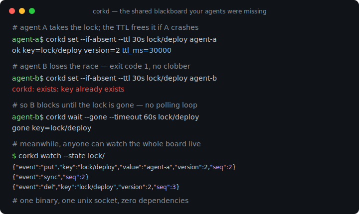
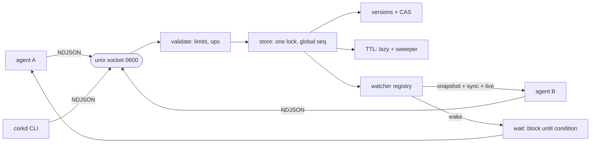

# corkd

[English](README.md) | [中文](README.zh.md) | [日本語](README.ja.md)

[](LICENSE) [](go.mod) [](CHANGELOG.md)  [](CONTRIBUTING.md)

**corkd：面向同机多 Agent 的开源共享黑板 —— 基于 unix socket 的可监听键值存储，带 CAS 与 TTL，让你的 Agent 不再通过临时文件互相踩踏。不是 Redis，也无需外部服务器。**



```bash
git clone https://github.com/JaydenCJ/corkd && cd corkd
go build -o corkd ./cmd/corkd    # single static binary, stdlib only
```

> 预发布说明：v0.1.0 尚未发布到任何包注册表；请按上述方式从源码构建（Go ≥1.22 均可）。

## 为什么选 corkd？

只要几个编码 Agent 并排运行，它们立刻就需要共享内存：谁持有部署锁、哪些任务已完成、当前构建状态是什么。民间方案——JSON 临时文件——集齐了所有经典并发 bug：两个 Agent 对同一文件读-改-写，其中一次写入凭空消失；崩溃的 Agent 留下永远不会消失的陈旧锁文件；而"等到 X 变化"退化成一个烧 token 又烧 CPU 的轮询循环。重量级方案 Redis 或 etcd，则意味着安装并伺候一个服务器、开放一个 TCP 端口、给每个 Agent 拖进一个客户端库——对同住一台机器的进程来说是荒谬的开销。corkd 是缺失的中间地带：一个静态二进制，通过 0600 权限的 unix socket 提供内存黑板。每次写入都获得全局唯一的版本号，CAS 因此轻而易举且免疫 ABA；TTL 把锁变成会自愈的租约；watch 提供"原子快照+实时"事件流，`corkd wait` 用一次阻塞读取替代所有轮询循环。任何能向 socket 写一行 JSON 的语言都是完整客户端——没有 SDK、没有端口、没有需要配置的守护进程。

| | corkd | 临时文件 + flock | Redis | etcd |
|---|---|---|---|---|
| 开发机上的安装成本 | 一个二进制，零配置 | 系统自带 | 安装并配置服务器 | 安装并配置集群级服务器 |
| 网络暴露面 | unix socket，0600 权限，永不开 TCP | 无 | 默认开 TCP 端口 | TCP + TLS 证书 |
| 所有写入/删除均支持 CAS | ✅ 版本号，免疫 ABA | ❌ 读-改-写竞争 | Lua / WATCH-MULTI 仪式 | ✅ revision |
| 带原子补齐回放的 watch | ✅ `--state`：快照 + sync + 实时 | ❌ | keyspace 事件，尽力而为，无回放 | ✅ |
| 阻塞等待键的变化 | ✅ 内置 `corkd wait` | ❌ 轮询 | 变通做法（挪用 BLPOP） | 客户端基于 watch 自行实现 |
| 自动过期的锁（TTL） | ✅ | ❌ 崩溃后留下陈旧文件 | ✅ | ✅ lease |
| 客户端要求 | 任何 JSON + socket，或直接用 CLI | shell | 客户端库 | gRPC 客户端库 |
| 运行时依赖 | 0（Go 标准库） | 0 | 服务器守护进程 | 服务器守护进程 |

<sub>核查于 2026-07-13：corkd 只引用 Go 标准库。Redis 与 etcd 在其本职领域——联网、持久化、多机状态——都非常出色；corkd 刻意只争夺单机多 Agent 这一种场景。</sub>

## 功能特性

- **处处可 CAS，免疫 ABA** —— 每次写入消耗一个全局序列号，版本号在整个黑板上全局唯一、永不复用；`--if-version`（0 = 仅创建）与 `--if-absent` 让丢失更新不可能发生，冲突响应携带当前版本号，重试无需额外往返。
- **精确且可观测的 TTL 租约** —— 过期在访问时惰性检查、由定时器主动清扫，总会发出 `expire` 事件；崩溃的锁持有者会自动释放它的锁。
- **不会漏事件的 watch** —— `watch --state` 在同一把锁下原子地完成快照与订阅：先是当前状态的 `put` 事件，然后是 `sync` 标记，随后是序列号无空洞的实时事件。慢消费者会被打上 `lagged` 标记后断开，绝不允许拖垮黑板。
- **用阻塞等待取代轮询循环** —— `corkd wait KEY`、`--equals VALUE` 或 `--gone` 让客户端在服务端挂起，直到条件满足或超时；屏障与锁队列都成了一行命令。
- **一个能用 `nc` 直接说的协议** —— unix socket 上的换行分隔 JSON（[docs/protocol.md](docs/protocol.md)）；每种语言天生自带客户端。
- **为脚本而生的 CLI** —— 退出码 0/1/2/3 把"条件未满足"与真正的错误分开，`if corkd set --if-absent …` 直接可用；处处支持 `--json` 供机器消费，`keys`/`dump`/`stats` 供人查看。
- **零依赖，零暴露** —— 只用 Go 标准库，没有 TCP 监听，socket 为 0600 权限，无遥测，无需任何配置。

## 快速上手

```bash
corkd serve &                                   # the board (one per user by default)
corkd set build/status green                    # publish
corkd get build/status                          # read
corkd set --if-absent --ttl 30s lock/deploy agent-a   # take a lease-lock
```

真实抓取的输出：

```text
$ corkd set --if-absent --ttl 30s lock/deploy agent-a
ok key=lock/deploy version=2 ttl_ms=30000
$ corkd set --if-absent --ttl 30s lock/deploy agent-b
corkd: exists: key already exists                # exit code 1 — agent-b lost the race
$ corkd get --json lock/deploy
{"ok":true,"key":"lock/deploy","value":"agent-a","version":2,"ttl_ms":29863}
```

两个 worker 各自执行过一次 `corkd incr jobs/done` 之后，以原子补齐回放的方式监听整个黑板（真实输出）：

```text
$ corkd watch --state --count 4 ''
{"event":"put","key":"build/status","value":"green","version":1,"seq":1}
{"event":"put","key":"jobs/done","value":"2","version":4,"seq":4}
{"event":"put","key":"lock/deploy","value":"agent-a","version":2,"seq":2}
{"event":"sync","seq":4}
```

阻塞到另一个 Agent 发布为止——没有轮询循环（真实输出）：

```text
$ corkd wait --timeout 10s go        # blocks…
now                                  # …until someone runs: corkd set go now
```

## CLI 参考

`corkd <command> [flags] [args]` —— flag 写在位置参数之前。退出码：0 成功，1 条件未满足（键不存在、CAS 冲突、wait 超时），2 用法错误，3 连接/服务器错误。

| 命令 | 主要 flag | 作用 |
|---|---|---|
| `serve` | `--socket`, `--sweep-interval`, `--quiet` | 前台运行黑板；SIGTERM 时清理 socket |
| `set KEY VALUE` | `--ttl`, `--if-version N`, `--if-absent` | 写入（VALUE 为 `-` 时读 stdin）；按版本号 CAS，0 = 仅创建 |
| `get KEY` | `--json` | 打印值（JSON 额外含版本号与剩余 TTL） |
| `del KEY` | `--if-version N` | 删除，可选地防止基于过期版本的误删 |
| `incr KEY` | `--by N`, `--ttl` | 原子计数器；允许负增量；默认保留 TTL |
| `wait KEY` | `--equals V`, `--gone`, `--timeout` | 阻塞到条件满足；打印满足条件的值 |
| `watch [PREFIX]` | `--state`, `--count N` | 流式输出 NDJSON 事件；`--state` = 先做原子快照回放 |
| `keys` / `dump [PREFIX]` | `--json` | 排序列表，不含 / 含值与 TTL |
| `stats` / `ping` | `--json` | 黑板计数器 / 存活检查 + 服务器版本 |

socket 路径按 `--socket` flag → `$CORKD_SOCKET` → `$XDG_RUNTIME_DIR/corkd.sock` → `$TMPDIR/corkd-<uid>.sock` 顺序解析，同一用户的所有 Agent 零配置即可找到同一块黑板。

## 协作配方

三个惯用法覆盖了绝大多数多 Agent 协作场景；[examples/](examples/README.md) 端到端地运行前两个。

| 模式 | 配方 |
|---|---|
| 带崩溃保险的互斥锁 | `set --if-absent --ttl 30s lock/X me` → 干活 → `del lock/X`；落选者 `wait --gone lock/X` |
| 屏障 / 交接 | 生产者：`set task/1 result`；消费者：`wait --timeout 60s task/1` |
| 进度汇聚 | 每个 worker `incr tasks/completed`；监督者 `wait --equals N tasks/completed` |

## 验证

本仓库不附带 CI；以上所有断言均由本地运行验证：

```bash
go test ./...            # 91 deterministic tests, offline, fake-clock TTLs, < 5 s
bash scripts/smoke.sh    # end-to-end CLI check over a real socket, prints SMOKE OK
```

## 架构



## 路线图

- [x] v0.1.0 —— unix socket 上的 CAS/TTL 黑板：带原子状态回放的 watch、阻塞式 wait、原子计数器、NDJSON 协议、脚本友好的 CLI、91 个测试 + smoke 脚本
- [ ] 可选快照文件（`--snapshot board.json`），在服务器重启后恢复
- [ ] `corkd lock` 语法糖：获取 → 执行命令 → 释放，带 TTL 心跳续约
- [ ] 前缀之外的 watch 过滤（glob、事件类型）与 `since_seq` 断点续传
- [ ] 按键的历史环形缓冲（`corkd log KEY`），用于事后排查
- [ ] 客户端包（导出 Go module、Python）—— 协议本身已让它们轻而易举

完整列表见 [open issues](https://github.com/JaydenCJ/corkd/issues)。

## 参与贡献

欢迎 issue、讨论与 PR —— 本地工作流（格式化、vet、测试、`SMOKE OK`）见 [CONTRIBUTING.md](CONTRIBUTING.md)。入门任务见 [good first issue](https://github.com/JaydenCJ/corkd/issues?q=is%3Aissue+is%3Aopen+label%3A%22good+first+issue%22) 标签，设计讨论请移步 [Discussions](https://github.com/JaydenCJ/corkd/discussions)。

## 许可证

[MIT](LICENSE)
